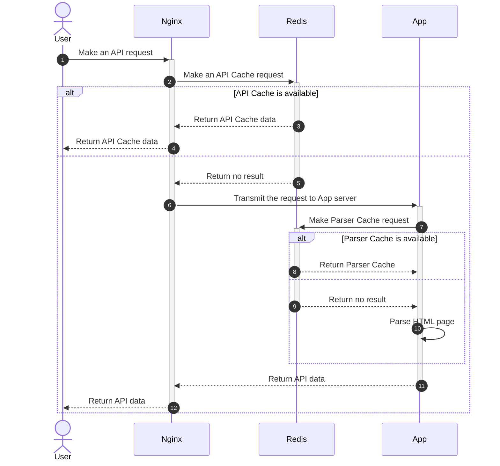
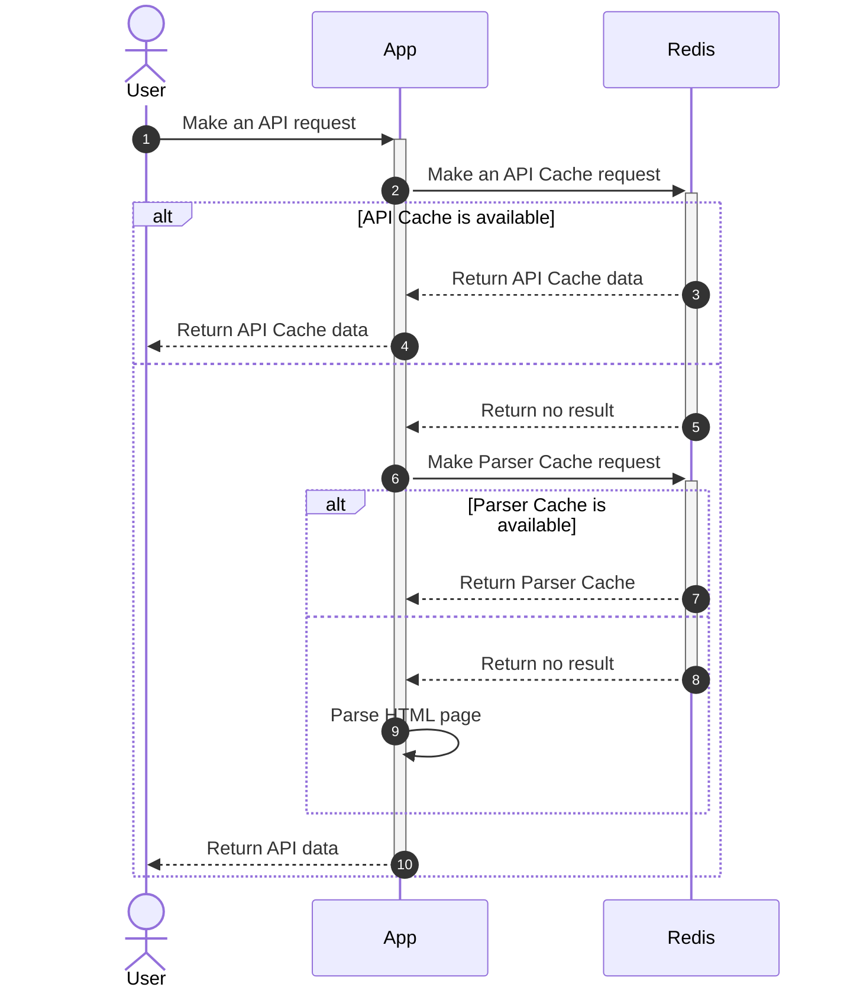
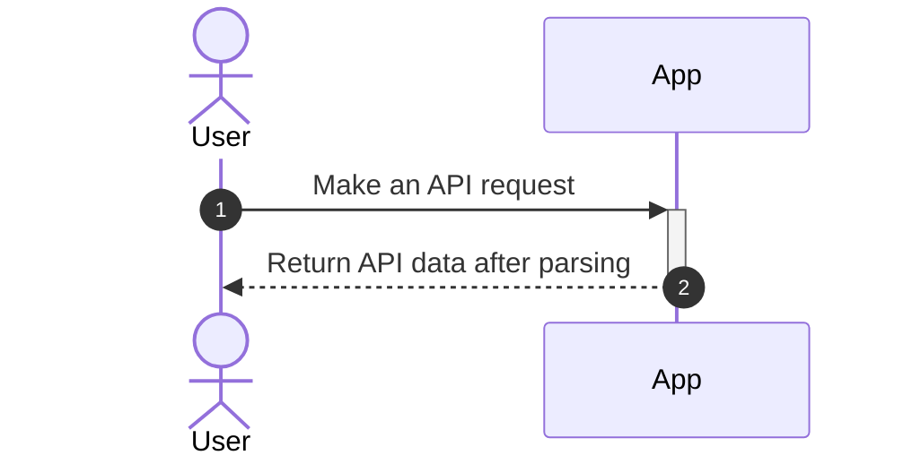

# ⚡ OverFast API

[](https://github.com/TeKrop/overfast-api/actions/workflows/build.yml)
[](https://sonarcloud.io/summary/new_code?id=TeKrop_overfast-api)

[](https://github.com/TeKrop/overfast-api/issues)
[](https://overfast-api.tekrop.fr)
[](https://github.com/TeKrop/overfast-api/blob/master/LICENSE)


> OverFast API provides comprehensive data on Overwatch 2 heroes, game modes, maps, and player statistics by scraping Blizzard pages. Developed with the efficiency of **FastAPI** and **Beautiful Soup**, it leverages **nginx** as a reverse proxy and **Redis** for caching. Its tailored caching mechanism significantly reduces calls to Blizzard pages, ensuring swift and precise data delivery to users.

## Table of contents
* [✨ Live instance](#-live-instance)
* [💽 Dev environment](#-dev-environment)
* [🐋 Docker](#-docker)
* [👨‍💻 Technical details](#-technical-details)
* [🛠️ Cache System](#%EF%B8%8F-cache-system)
* [🐍 Architecture](#-architecture)
* [🤝 Contributing](#-contributing)
* [🚀 Community projects](#-community-projects)
* [🙏 Credits](#-credits)
* [📝 License](#-license)


## ✨ [Live instance](https://overfast-api.tekrop.fr)
The live instance is restricted to **30 req/s** (a shared limit across all endpoints). If you require more, consider hosting your own instance on a server 👍

- Live instance (Redoc documentation) : https://overfast-api.tekrop.fr/
- Swagger UI : https://overfast-api.tekrop.fr/docs
- Status page : https://stats.uptimerobot.com/E0k0yU1pJQ

## 💽 Dev environment

### Requirements
* 🐍 Python 3.12
* 📜 Poetry

### Install

- Clone the project
- Rename `.env.dist` into `.env`, and edit the configuration in order to match your needs
- Run `poetry install` to install all the dependencies (+ dev dependencies)

### Launch

```
uvicorn app.main:app --reload
```

## 🐋 Docker

Before getting started, create a `.env` file from the provided `.env.dist` template. Customize this file according to your requirements to configure the volumes used by the OverFast API. Ensure to review and adjust the settings as necessary, and also set up the app volume folder before proceeding.

### Generic settings
- `APP_VOLUME_PATH`: Folder for shared app data like logs, Redis save file, settings, and crontab configurations for background cache updates.
- `APP_PORT`: Port for the app container (default is `80`).
- `APP_BASE_URL` : Base URL for exposed links in endpoints like player search and maps listing. 
You likely won't need to modify other generic settings, but if you're curious about their functionality, consult the docstrings within the `app/config.py` file for further details.

### App volume folder
In order to make the app work properly, you have to :
- Create the folder located at `APP_VOLUME_PATH` on your side
- Copy the `.env` file you previously created into the folder
- Copy the `overfast-crontab` file from the repo (`scripts` folder) into the folder

### Final step
After configuring your dotenv and creating the app volume folder, simply use the Docker Compose command to build and run the app seamlessly.
```
docker compose up -d
```
The server will be running on the port you set (`APP_PORT`).

## 👨‍💻 Technical details

### Computed statistics values

In player career statistics, various conversions are applied for ease of use:
- **Duration values** are converted to **seconds** (integer)
- **Percent values** are represented as **integers**, omitting the percent symbol
- Integer and float string representations are converted to their respective types

### Commands

The commands serve two purposes:
- Automated checks determine if cache updates are necessary or if a new hero has been added to Blizzard pages, triggering code updates
- Manual updates are performed to refresh the test fixtures used in the test suite

#### Check and update Redis cache which needs to be updated
```
python -m app.commands.check_and_update_cache
```

#### Check if there is a new hero available, and notify the developer if there is any
```
python -m app.commands.check_new_hero
```

#### Update test fixtures

Generic command (update heroes, gamemodes and roles)
```
python -m app.commands.update_test_fixtures
```

Help message (with different options)
```
usage: update_test_fixtures.py [-h] [-He] [-Ho] [-P]

Update test data fixtures by retrieving Blizzard pages directly. By default, all the tests data will be updated.

options:
  -h, --help     show this help message and exit
  -He, --heroes  update heroes test data
  -Ho, --home    update home test data (gamemodes, roles)
  -P, --players  update players test data
```

### Code Quality
The code quality is checked using the `ruff` command. I'm also using `ruff format` for imports ordering and code formatting, enforcing PEP-8 convention on my code. To check the quality of the code, you just have to run the following command :

```
ruff .
```

### Testing
The code has been tested using (a lot of) unit testing, except some rare parts which are not relevant to test. There are tests on the parsers classes, the common classes, but also on the commands (run in CLI) and the API views (using FastAPI TestClient class).

Running tests (simple)
```
python -m pytest
```
Running tests (with coverage)
```
python -m pytest --cov=app --cov-report html
```

### Pre-commit
The project is using [pre-commit](https://pre-commit.com/) framework to ensure code quality before making any commit on the repository. After installing the project dependencies, you can install the pre-commit by using the `pre-commit install` command.

The configuration can be found in the `.pre-commit-config.yaml` file. It consists in launching 3 processes on modified files before making any commit :
- `ruff` for linting and code formatting (with `ruff format`)
- `sourcery` for more code quality checks and a lot of simplifications

## 🛠️ Cache System

### API Cache and Parser Cache

OverFast API integrates a **Redis**-based cache system, divided into two main components:
- **API Cache**: This high-level cache associates URIs (cache keys) with raw JSON data. Upon the initial request, if a cache entry exists, the **nginx** server returns the JSON data directly. Cached values are stored with varying TTL (Time-To-Live) parameters depending on the requested route.
- **Parser Cache**: Specifically designed for the API's parsing system, this cache stores parsing results (JSON objects) from HTML Blizzard pages. Its purpose is to minimize calls to Blizzard servers when requests involve filters. The cached values are refreshed in the background prior to expiration.

Here is the list of all TTL values configured for API Cache :
* Heroes list : 1 day
* Hero specific data : 1 day
* Roles list : 1 day
* Gamemodes list : 1 day
* Maps list : 1 day
* Players career : 1 hour
* Players search : 1 hour

### Refresh-Ahead cache system

To minimize requests to Blizzard servers, an innovative Refresh-Ahead cache system has been deployed.

Upon the initial request for a player's career page, there may be a slight delay (approximately 2-3 seconds) as data is fetched from Blizzard. Following this, the computed data is cached in the Parser Cache, which is subsequently refreshed in the background before expiration. Additionally, the final data is stored in the API Cache, which is generated only upon user requests.

This approach ensures that subsequent requests for the same career page are exceptionally swift, significantly enhancing user experience.

## 🐍 Architecture
You have multiple options for running the project, but for an optimal user experience, I recommend the first method.

### App (uvicorn) + Redis server (caching) + nginx


Utilizing `docker compose`, this method caches the response into Redis. Subsequent requests are then directly served by nginx without involving the Python server at all. This approach strikes the optimal performance balance, leveraging nginx's efficiency in serving static content. Depending on the configured Blizzard pages, a single request may trigger multiple Parser Cache requests.

### App (uvicorn) + Redis server (caching)


When manually executing the process, the response gets cached into Redis, and the Python server checks the cache (`USE_API_CACHE_IN_APP` must be set to `True`). While this compromise is acceptable, it's worth noting that cache retrieval is approximately 100 times slower compared to the previous solution (verified with [wrk](https://github.com/wg/wrk)).

### App (uvicorn) only

Using only the image built with the `Dockerfile` alone means there won't be any cache, resulting in every call making requests to Blizzard pages. I recommend avoiding this approach except for debugging purposes.

## 🤝 Contributing

Contributions, issues and feature requests are welcome ! Do you want to update the heroes data (health, armor, shields, etc.) or the maps list ? Don't hesitate to consult the dedicated [CONTRIBUTING file](https://github.com/TeKrop/overfast-api/blob/main/CONTRIBUTING.md).


## 🚀 Community projects
Projects using OverFast API as a data source are listed below. Using it in your project? Reach out via email with your project link, and I'll add it!

- Datastrike, analysis and results tracking tool (https://datastrike.cloud)
- Discord Bot OW2 for stats (https://github.com/polsojac/ow2discordbot)
- OverBot, the best Overwatch bot for Discord (https://github.com/davidetacchini/overbot)
- Overfast API client (https://github.com/Sipixer/overfast-api-client)
- Overwatch Career Profile (https://github.com/EliaRenov/ow-career-profile)
- OverwatchPy, a Python wrapper for the API (https://github.com/alexraskin/overwatchpy)
- Watch Over, mobile app by @Backxtar (https://play.google.com/store/apps/details?id=de.backxtar.watchoveroverwatch)

## 🙏 Credits

All maps screenshots hosted by the API are owned by Blizzard. Sources :
- Blizzard Press Center (https://blizzard.gamespress.com)
- Overwatch Wiki (https://overwatch.fandom.com/wiki/)


## 📝 License

Copyright © 2021-2023 [Valentin PORCHET](https://github.com/TeKrop).

This project is [MIT](https://github.com/TeKrop/overfast-api/blob/master/LICENSE) licensed.
