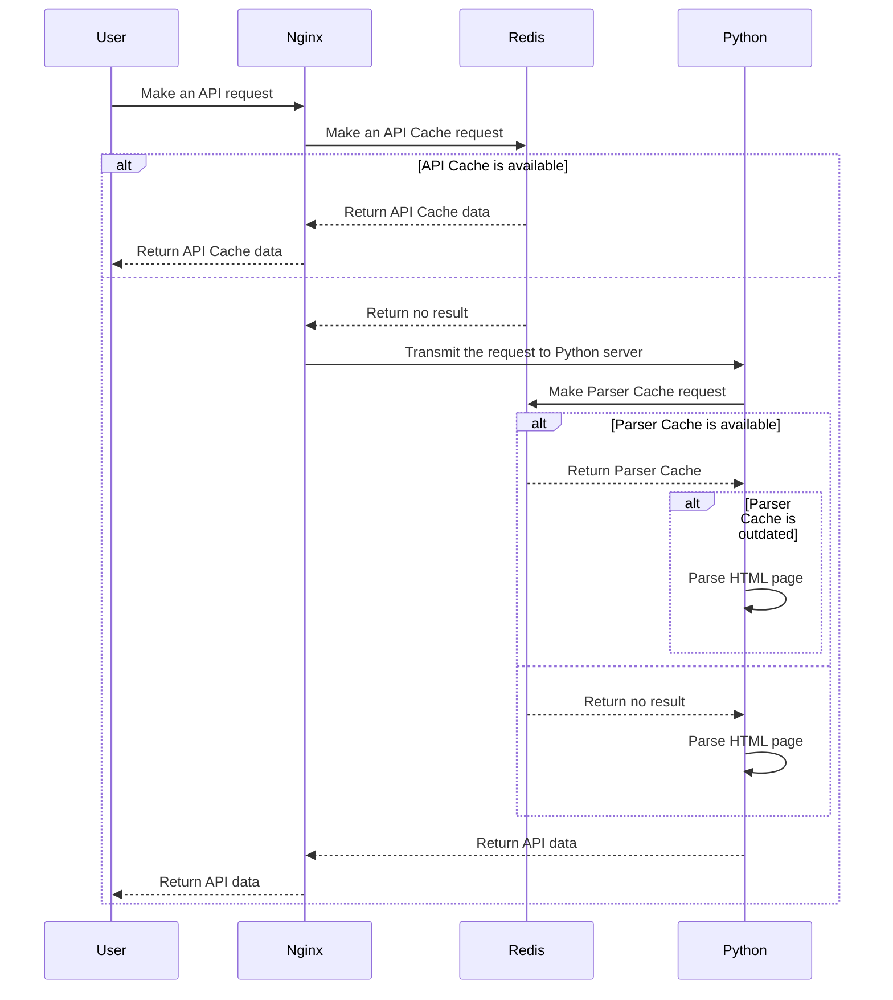
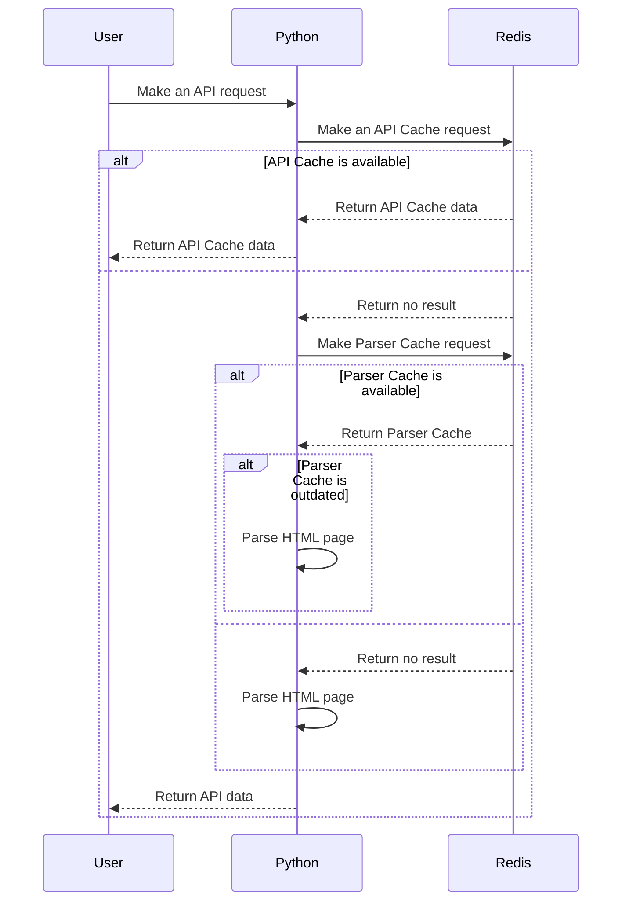
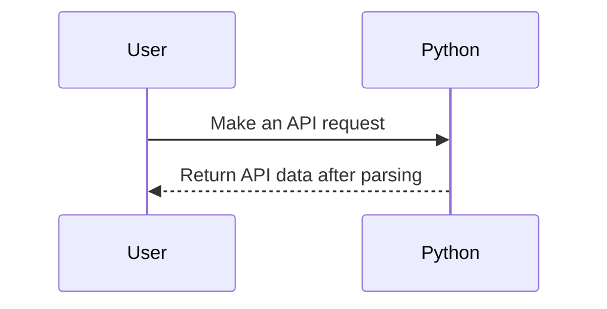

# ⚡ OverFast API

[](https://pycqa.github.io/isort/)
[](https://github.com/TeKrop/overfast-api/actions/workflows/ruff.yml)

[](https://github.com/TeKrop/overfast-api/issues)
[](https://overfast-api.tekrop.fr)
[](https://github.com/TeKrop/overfast-api/blob/master/LICENSE)


> OverFast API gives data about Overwatch heroes, gamemodes, and (soon) players statistics by scraping Blizzard pages. Built with **FastAPI** and **Beautiful Soup**, and uses **nginx** as reverse proxy and **Redis** for caching. By using a specific cache system, it minimizes calls to Blizzard pages (which can be very slow), and quickly returns accurate data to users.

## 🚧 Work in progress 🚧

I'm currently rewriting the API for new Overwatch 2 pages. So far, here is the progress :
- Heroes list : ✅
- Hero specific data : ✅
- Roles list : ✅
- Gamemodes list : ✅
- Players career : 😴 (waiting for Blizzard to put them back)
- Players search : 😴 (waiting for Blizzard to put the page back)

## Table of contents
* [✨ Demo](#-demo)
* [🛠️ Cache System](#%EF%B8%8F-cache-system)
* [🐍 Architecture](#-architecture)
* [💽 Installation](#-installation)
* [🐋 Docker](#-docker)
* [👨‍💻 Technical details](#-technical-details)
* [🤝 Contributing](#-contributing)
* [📝 License](#-license)


## ✨ [Demo](https://overfast-api.tekrop.fr)

You can see and use a live version of the API here, the root URL being the Redoc documentation : https://overfast-api.tekrop.fr/.

If you want to use the API, and you have the possibility to host your own instance, please do it (at least for production environment), in order to not overload the live version i'm hosting.

## 🛠️ Cache System

### API Cache and Parser Cache

OverFast API introduces a very specific cache system, stored on a **Redis** server, and divided in two parts :
* **API Cache** : a very high level cache, linking URIs (cache key) to raw JSON data. When first doing a request, if a cache is available, the JSON data is returned as-is by the **nginx** server. The cached values are stored with an arbitrary TTL (time to leave) parameter depending on the called route.
* **Parser Cache** : a specific cache for the parser system of the OverFast API. When an HTML Blizzard page is parsed, a hash of the HTML content and the parsing result (as a JSON string) are stored, in order to minimize the heavy parsing process if the page hasn't changed since the last API call. There is no TTL on this cache.

Here is the list of all TTL values configured for API Cache :
* Heroes list : 1 day
* Hero specific data : 1 day
* Roles list : 1 day
* Gamemodes list : 1 day

### Automatic cache refresh

In order to reduce the number of requests to Blizzard that API users can make, I introduced a specific cache refresh system. The main idea is to update the API Cache in the background (server side) when needed, just before its expiration. For example, if a user requests its player career page, it will be slow for the first call (2-3s in total), but very fast for all the next times, thanks to this system.

I know that this system is rudimentary, and could be memory consuming if a lot of pages are getting cached. I just did it as an personal exercise, and it shall be improved if the API users base is growing faster than the memory available on my server.

## 🐍 Architecture
You can run the project in several ways, though I would advise the first one for better user experience.

### Python (uvicorn) + Redis server (caching) + nginx


Using this way (via `docker-compose`), all the responses will be cached into Redis, and will be sent by nginx directly for the next times without requesting the Python server at all. It's the best performance compromise as nginx is the best for serving static content. A single request can lead to several Parser Cache requests, depending on configured Blizzard pages.

### Python (uvicorn) + Redis server (caching)


Using this way (by manually doing it), all the responses will be cached into Redis, and the cache will be checked by the Python server (`USE_API_CACHE_IN_APP` setting in `config.py` must be set to `True`). It's an acceptable compromise.

### Python (uvicorn) only

Using this way (only using the image built with the `Dockerfile` alone), there will be no cache at all, and every call will make requests to Blizzard pages. I advise not to use this way unless for debugging eventually.

## 💽 Installation

### Requirements
* Python 3.11
* Poetry
* Docker & Docker Compose (production)

### Install process

- Clone the project
- Create a `config.py` file from the `config.example.py` template file (inside `overfastapi` folder)
- Edit the configuration file to match your needs
- Finally, simply run `poetry install` to install all the dependencies (+ dev dependencies)

### Launch

```
uvicorn overfastapi.main:app --reload
```

## 🐋 Docker

Standalone (no cache system)
```
docker build . -t tekrop/overfast-api:latest
docker run -d -p 80:80 --name overfast-api tekrop/overfast-api
```

Definitive edition (with cache system)
```
docker-compose up
```

## 👨‍💻 Technical details

### Commands

The following commands are either used :
- In an automated way, for checking if cache values need to be updated, or if a new hero has been published on Blizzard pages (the code needs to be updated if this is the case)
- In a manual way, in order to update the test fixtures used in the test suite

#### Check and update Redis cache which needs to be updated
```
python -m overfastapi.commands.check_and_update_cache
```

#### Check if there is a new hero available, and notify the developer if there is one
```
python -m overfastapi.commands.check_new_hero
```

#### Update test fixtures

Generic command (update heroes, gamemodes and roles)
```
python -m overfastapi.commands.update_test_fixtures
```

Help message (with different options)
```
usage: update_test_fixtures.py [-h] [-He] [-Ho]

Update test data fixtures by retrieving Blizzard pages directly. By default, all the tests data will be updated.

options:
  -h, --help     show this help message and exit
  -He, --heroes  update heroes test data
  -Ho, --home    update home test data (gamemodes, roles)
```

### Code Quality
The code quality is checked using the `ruff` command. I'm also using the `isort` utility for imports ordering, and `black` to enforce PEP-8 convention on my code. To check the quality of the code, you just have to run the following command :

```
ruff .
```

### Testing
The code has been tested using (a lot of) unit testing, except some rare parts which are not relevant to test. There are tests on the parsers classes, the common classes, but also on the commands (run in CLI) and the API views (using FastAPI TestClient class).

Running tests (simple)
```
python -m pytest
```
Running tests (with coverage)
```
python -m pytest --cov=overfastapi --cov-report html
```

## 🤝 Contributing

Contributions, issues and feature requests are welcome!

Feel free to check [issues page](https://github.com/TeKrop/overfast-api/issues).

## 📝 License

Copyright © 2021-2022 [Valentin PORCHET](https://github.com/TeKrop).

This project is [MIT](https://github.com/TeKrop/overfast-api/blob/master/LICENSE) licensed.
