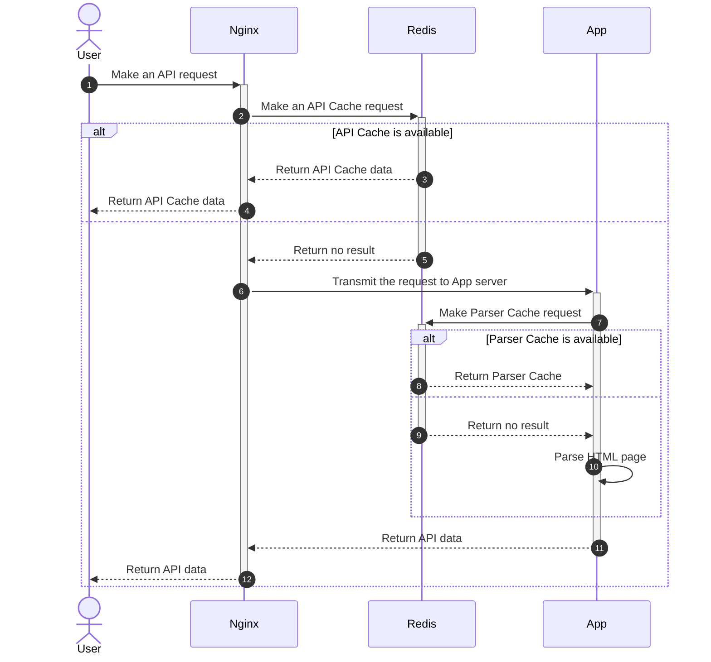
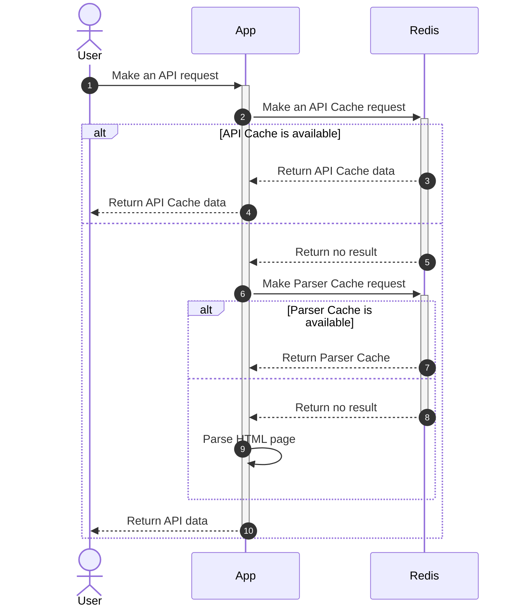
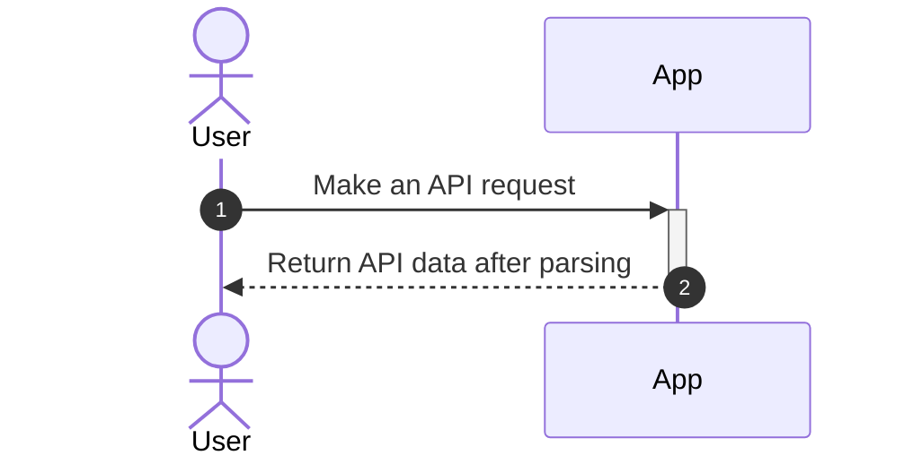

# ⚡ OverFast API

[](https://github.com/TeKrop/overfast-api/actions/workflows/build.yml)
[](https://sonarcloud.io/summary/new_code?id=TeKrop_overfast-api)

[](https://github.com/TeKrop/overfast-api/issues)
[](https://overfast-api.tekrop.fr)
[](https://github.com/TeKrop/overfast-api/blob/master/LICENSE)


> OverFast API gives data about Overwatch 2 heroes, gamemodes, maps and players statistics by scraping Blizzard pages. Built with **FastAPI** and **Beautiful Soup**, and uses **nginx** as reverse proxy and **Redis** for caching. By using a specific cache system, it minimizes calls to Blizzard pages (which can be very slow), and quickly returns accurate data to users.

## Table of contents
* [✨ Live instance](#-live-instance)
* [💽 Dev environment](#-dev-environment)
* [🐋 Docker](#-docker)
* [👨‍💻 Technical details](#-technical-details)
* [🛠️ Cache System](#%EF%B8%8F-cache-system)
* [🐍 Architecture](#-architecture)
* [🤝 Contributing](#-contributing)
* [🚀 Community projects](#-community-projects)
* [🙏 Credits](#-credits)
* [📝 License](#-license)


## ✨ [Live instance](https://overfast-api.tekrop.fr)

You can see and use a live version of the API here, the root URL being the Redoc documentation : https://overfast-api.tekrop.fr/

You can also consult the Swagger UI documentation, useful for directly trying API calls : https://overfast-api.tekrop.fr/docs

## 💽 Dev environment

### Requirements
* 🐍 Python 3.11
* 🪶 Poetry

### Install

- Clone the project
- Rename `.env.example` into `.env`, and edit the configuration in order to match your needs
- Run `poetry install` to install all the dependencies (+ dev dependencies)

### Launch

```
uvicorn app.main:app --reload
```

## 🐋 Docker

First, you need to create a dotenv file (`.env`) from the `.env.example` file. You'll need to modify it depending on your needs in order to configure the volumes used by OverFast API. You'll have to check
some settings and create the app volume folder.

### Generic settings
- `APP_VOLUME_PATH` is the folder which will contain shared data of the app : logs, redis save file (`dump.rdb`), settings file (`.env`) and crontab configurations for background cache update.
- `APP_PORT` is the port used by the app container. Default is `80`.
- `APP_BASE_URL` is used for the links exposed in some endpoints (players search and maps listing)
You shouldn't need to modify any other generic setting, but in case you want to check their utility, be sure to check the docstrings in the `app/config.py` file.

### App volume folder
In order to make the app work properly, you have to :
- Create the folder located at `APP_VOLUME_PATH` on your side
- Copy the `.env` file you previously created into the folder
- Copy the `overfast-crontab` file from the repo (`scripts` folder) into the folder

### Final step
Once you set the right values in your dotenv and created the app volume folder, you can finally use the docker compose command to build everything and run the app
```
docker compose up -d
```
The server will be running on the port you set (`APP_PORT`).

## 👨‍💻 Technical details

### Computed statistics values

In players career statistics, several conversions are made for convenience :
- all **duration values** are converted into **seconds** (integer)
- **percent values** are exposed as **integers** instead of a string with a percent symbol
- integer and float string representations are converted into the concerned type

### Commands

The following commands are either used :
- In an automated way, for checking if cache values need to be updated, or if a new hero has been published on Blizzard pages (the code needs to be updated if this is the case)
- In a manual way, in order to update the test fixtures used in the test suite

#### Check and update Redis cache which needs to be updated
```
python -m app.commands.check_and_update_cache
```

#### Check if there is a new hero available, and notify the developer if there is one
```
python -m app.commands.check_new_hero
```

#### Update test fixtures

Generic command (update heroes, gamemodes and roles)
```
python -m app.commands.update_test_fixtures
```

Help message (with different options)
```
usage: update_test_fixtures.py [-h] [-He] [-Ho] [-P]

Update test data fixtures by retrieving Blizzard pages directly. By default, all the tests data will be updated.

options:
  -h, --help     show this help message and exit
  -He, --heroes  update heroes test data
  -Ho, --home    update home test data (gamemodes, roles)
  -P, --players  update players test data
```

### Code Quality
The code quality is checked using the `ruff` command. I'm also using the `isort` utility for imports ordering, and `black` to enforce PEP-8 convention on my code. To check the quality of the code, you just have to run the following command :

```
ruff .
```

### Testing
The code has been tested using (a lot of) unit testing, except some rare parts which are not relevant to test. There are tests on the parsers classes, the common classes, but also on the commands (run in CLI) and the API views (using FastAPI TestClient class).

Running tests (simple)
```
python -m pytest
```
Running tests (with coverage)
```
python -m pytest --cov=app --cov-report html
```

## 🛠️ Cache System

### API Cache and Parser Cache

OverFast API includes a cache stored on a **Redis** server, and divided in two parts :
* **API Cache** : a very high level cache, linking URIs (cache key) to raw JSON data. When first doing a request, if a cache is available, the JSON data is returned as-is by the **nginx** server. The cached values are stored with an arbitrary TTL (time to leave) parameter depending on the called route.
* **Parser Cache** : a specific cache for the parser system of the OverFast API. When an HTML Blizzard page is parsed, the parsing result (JSON object) is stored, in order to minimize calls to Blizzard when doing a request with filters. The value is refreshed in the background before its expiration.

Here is the list of all TTL values configured for API Cache :
* Heroes list : 1 day
* Hero specific data : 1 day
* Roles list : 1 day
* Gamemodes list : 1 day
* Maps list : 1 day
* Players career : 1 hour
* Players search : 1 hour

### Refresh-Ahead cache system

In order to reduce the number of requests to Blizzard that API users can make, a Refresh-Ahead cache system has been implemented.

When a user requests its player career page, it will be slow for the first call (2-3s in total), as it's retrieving data from Blizzard. Then, the computed data will be stored in the Parser Cache (which will be refreshed in background), and the final data will be stored in API Cache (only created when a user makes a request).

Thanks to this system, user requests on the same career page will be very fast for all the next times.

## 🐍 Architecture
You can run the project in several ways, though I would advise the first one for better user experience.

### App (uvicorn) + Redis server (caching) + nginx


Using this way (via `docker-compose`), the response will be cached into Redis, and will be sent by nginx directly for the next times without requesting the Python server at all. It's the best performance compromise as nginx is the best for serving static content. A single request can lead to several Parser Cache requests, depending on configured Blizzard pages.

### App (uvicorn) + Redis server (caching)


Using this way (by manually doing it), the response will be cached into Redis, and the cache will be checked by the Python server (`USE_API_CACHE_IN_APP` setting in `config.py` must be set to `True`). It's an acceptable compromise, but keep in mind that cache retrieval is ~100 times slower than the previous solution (tested with [wrk](https://github.com/wg/wrk)).

### App (uvicorn) only

Using this way (only using the image built with the `Dockerfile` alone), there will be no cache at all, and every call will make requests to Blizzard pages. I advise not to use this way unless for debugging.

## 🤝 Contributing

Contributions, issues and feature requests are welcome ! Do you want to update the heroes data (health, armor, shields, etc.) or the maps list ? Don't hesitate to consult the dedicated [CONTRIBUTING file](https://github.com/TeKrop/overfast-api/blob/main/CONTRIBUTING.md).


## 🚀 Community projects

Here is a list of projects which are currently using OverFast API as a data source. You're using it in one of your projects ? Feel free to reach me by e-mail, send me a link of your project (either website URL or public git repository), and I will add it in the list :)

- Overfast API client (https://github.com/Sipixer/overfast-api-client)
- Watch Over, mobile app by @Backxtar (https://github.com/Backxtar)
- Overwatch Career Profile (https://github.com/EliaRenov/ow-career-profile)
- Discord Bot OW2 for stats (https://github.com/polsojac/ow2discordbot)

## 🙏 Credits

All maps screenshots hosted by the API are owned by Blizzard. Sources :
- Blizzard Press Center (https://blizzard.gamespress.com)
- Overwatch Wiki (https://overwatch.fandom.com/wiki/)


## 📝 License

Copyright © 2021-2023 [Valentin PORCHET](https://github.com/TeKrop).

This project is [MIT](https://github.com/TeKrop/overfast-api/blob/master/LICENSE) licensed.
