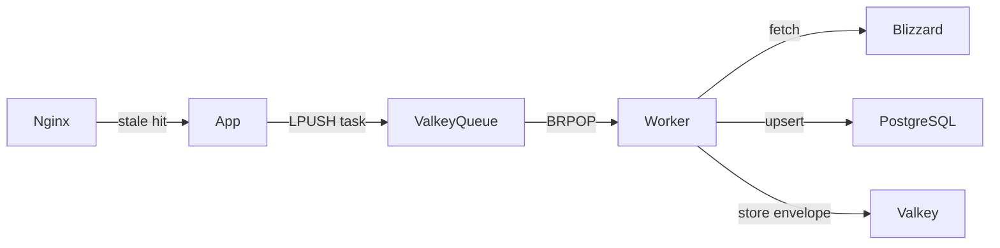
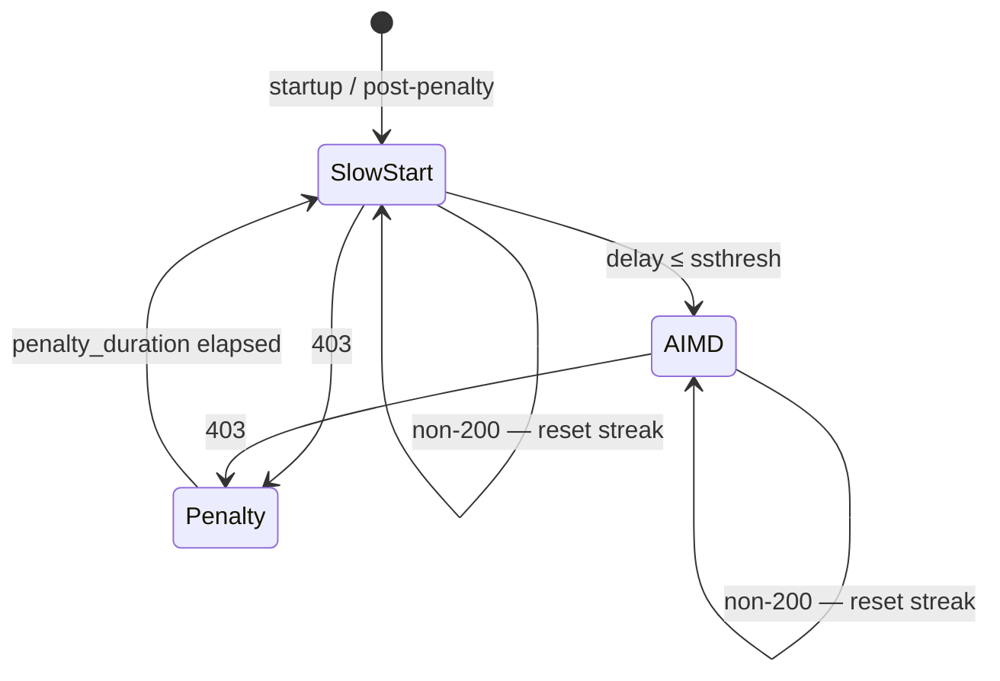

# ⚡ OverFast API

[](https://github.com/TeKrop/overfast-api/actions/workflows/build.yml)
[](https://sonarcloud.io/summary/new_code?id=TeKrop_overfast-api)

[](https://github.com/TeKrop/overfast-api/issues)
[](https://overfast-api.tekrop.fr)
[](https://github.com/TeKrop/overfast-api/blob/master/LICENSE)


> **v4.0** — OverFast API now runs on a redesigned architecture introducing **Domain-Driven Design**, **persistent storage with PostgreSQL**, **Stale-While-Revalidate caching**, **taskiq background workers**, and **TCP Slow Start + AIMD throttling** for Blizzard requests.

> OverFast API provides comprehensive data on Overwatch heroes, game modes, maps, and player statistics by scraping Blizzard pages. Developed with the efficiency of **FastAPI** and **Selectolax**, it leverages **nginx (OpenResty)** as a reverse proxy and **Valkey** for caching. Its tailored caching mechanism significantly reduces calls to Blizzard pages, ensuring swift and precise data delivery to users.

## Table of contents
* [✨ Live instance](#-live-instance)
* [🐋 Run for production](#-run-for-production)
* [💽 Run as developer](#-run-as-developer)
* [👨‍💻 Technical details](#-technical-details)
* [🐍 Architecture](#-architecture)
* [🤝 Contributing](#-contributing)
* [🚀 Community projects](#-community-projects)
* [🙏 Credits](#-credits)
* [📝 License](#-license)


## ✨ [Live instance](https://overfast-api.tekrop.fr)
The live instance operates with a rate limit applied per second, shared across all endpoints. You can view the current rate limit on the home page, and this limit may be adjusted as needed. For higher request throughput, consider hosting your own instance on a dedicated server 👍

- Live instance (Redoc documentation) : https://overfast-api.tekrop.fr/
- Swagger UI : https://overfast-api.tekrop.fr/docs
- Status page : https://uptime-overfast-api.tekrop.fr/

## 🐋 Run for production
Running the project is straightforward. Ensure you have `docker` and `docker compose` installed. Next, generate a `.env` file using the provided `.env.dist` template. Finally, if `just` is already installed on your machine, execute the following command :

```shell
just up
```

You can also use the `Makefile` alternative :

```shell
make up
```

## 💽 Run as developer
Same as earlier, ensure you have `docker` and `docker compose` installed, and generate a `.env` file using the provided `.env.dist` template. You can customize the `.env` file according to your requirements to configure the volumes used by the OverFast API.

Then, execute the following commands to launch the dev server (you can still use the `make` alternative if `just` is not installed on your machine) :

```shell
just build          # Build the images, needed for all further commands
just start          # Launch OverFast API (dev mode with autoreload)
just start_testing  # Launch OverFast API (testing mode, with reverse proxy)
```
The dev server will be running on the port `8000`. Reverse proxy will be running on the port `8080` in testing mode. You can use the `just down` command to stop and remove the containers. Feel free to type `just` or `just help` to access a comprehensive list of all available commands for your reference.

### Generic settings
Should you wish to customize according to your specific requirements, here is a detailed list of available settings:

- `APP_VOLUME_PATH`: Folder for shared app data like logs, Valkey save file and dotenv file (app settings)
- `APP_PORT`: Port for the app container (default is `80`).
- `APP_BASE_URL` : Base URL for exposed links in endpoints like player search and maps listing.
- `POSTGRES_HOST`, `POSTGRES_PORT`, `POSTGRES_DB`, `POSTGRES_USER`, `POSTGRES_PASSWORD`: PostgreSQL connection settings for persistent storage.

You likely won't need to modify other generic settings, but if you're curious about their functionality, consult the docstrings within the `app/config.py` file for further details.

### Code Quality
The code quality is checked using `ruff` for linting and formatting, and `ty` for type checking. I'm also using `ruff format` for imports ordering and code formatting, enforcing PEP-8 convention on my code. To check the quality of the code, you just have to run the following commands :

```shell
just check     # Run ty type checker
just lint      # Run ruff linter
just format    # Run ruff formatter
```

### Testing
The code has been tested using unit testing, except some rare parts which are not relevant to test. There are tests on the parsers classes, the common classes, but also on the commands (run in CLI) and the API views (using FastAPI TestClient class).

Running tests with coverage (default)
```shell
just test
```

Running tests with given args (without coverage)
```shell
just test tests/common
make test PYTEST_ARGS="tests/common"
```


### Pre-commit
The project is using [pre-commit](https://pre-commit.com/) framework to ensure code quality before making any commit on the repository. After installing the project dependencies, you can install the pre-commit by using the `pre-commit install` command.

The configuration can be found in the `.pre-commit-config.yaml` file. It consists in launching 2 processes on modified files before making any commit :
- `ruff` for linting and code formatting (with `ruff format`)
- `sourcery` for more code quality checks and a lot of simplifications

## 👨‍💻 Technical details

### Computed statistics values

In player career statistics, various conversions are applied for ease of use:
- **Duration values** are converted to **seconds** (integer)
- **Percent values** are represented as **integers**, omitting the percent symbol
- Integer and float string representations are converted to their respective types

### Valkey caching

OverFast API integrates a **Valkey**-based cache system with two main components:
- **API Cache**: This high-level cache associates URIs (cache keys) with a **SWR envelope** — a JSON object containing the response payload alongside metadata (`stored_at`, `staleness_threshold`, `stale_while_revalidate`). Nginx reads this envelope directly to serve `Age` and `Cache-Control: stale-while-revalidate` headers without calling FastAPI when data is stale but within the SWR window.
- **Player Cache**: Stores persistent player profiles. This is backed by **PostgreSQL**, with Valkey used for short-lived negative caching (unknown players).

Below is the current list of TTL values configured for the API cache. The latest values are available on the API homepage.
* Heroes list : 1 day
* Hero specific data : 1 day
* Roles list : 1 day
* Gamemodes list : 1 day
* Maps list : 1 day
* Players career : 1 hour
* Players search : 10 min

## 🐍 Architecture

### Request flow (Stale-While-Revalidate)

Every cached response is stored in Valkey as an **SWR envelope** containing the payload and three timestamps: `stored_at`, `staleness_threshold`, and `stale_while_revalidate`. Nginx/OpenResty inspects the envelope on every request:

- **Fresh** (age < `staleness_threshold`): Nginx returns cached data immediately, no App involved.
- **Stale** (age ≥ `staleness_threshold` but < `stale_while_revalidate`): Nginx returns the stale data immediately *and* fires an async enqueue to the background worker to refresh it.
- **Expired / missing**: Nginx forwards to the App, which fetches from Blizzard, stores a new envelope, and returns the response.

```mermaid
sequenceDiagram
    autonumber
    actor User
    participant Nginx
    participant Valkey
    participant App
    participant Worker
    participant Blizzard

    User->>+Nginx: Make an API request
    Nginx->>+Valkey: Check API cache (SWR envelope)

    alt Fresh cache hit
        Valkey-->>Nginx: Return fresh data
        Nginx-->>User: Return cached data
    else Stale hit (within SWR window)
        Valkey-->>-Nginx: Return stale data + metadata
        Nginx-->>User: Return stale data (with Age header)
        Nginx->>App: Enqueue background refresh (async)
        App->>Worker: Push refresh task to Valkey queue
        Worker->>+Blizzard: Fetch updated data
        Blizzard-->>-Worker: Return data
        Worker->>Valkey: Store new SWR envelope
    else Cache miss
        Valkey-->>-Nginx: No result
        Nginx->>+App: Forward request
        App->>+Blizzard: Fetch data
        Blizzard-->>-App: Return data
        App->>App: Parse response
        App->>Valkey: Store SWR envelope
        App-->>-Nginx: Return data
        Nginx-->>-User: Return data
    end
```

### Player profile flow

Player profiles follow the same SWR logic, with the addition that parsed profile data is persisted in **PostgreSQL**. The worker compares the current `lastUpdated` value from the Blizzard search endpoint before deciding whether to re-parse the HTML.

```mermaid
sequenceDiagram
    autonumber
    actor User
    participant Nginx
    participant Valkey
    participant App
    participant Worker
    participant PostgreSQL
    participant Blizzard

    User->>+Nginx: Make player profile request
    Nginx->>+Valkey: Check API cache (SWR envelope)

    alt Fresh cache hit
        Valkey-->>Nginx: Return fresh data
        Nginx-->>User: Return cached data
    else Stale hit (within SWR window)
        Valkey-->>-Nginx: Return stale data
        Nginx-->>User: Return stale data (with Age header)
        Nginx->>App: Enqueue refresh_player_profile task
        App->>Worker: Push task to Valkey queue
        Worker->>+Blizzard: Fetch search data (lastUpdated)
        Blizzard-->>-Worker: Return search data
        Worker->>+PostgreSQL: Load stored profile
        PostgreSQL-->>-Worker: Return stored profile
        alt lastUpdated unchanged
            Worker->>Valkey: Refresh SWR envelope (no re-parse)
        else Profile changed
            Worker->>+Blizzard: Fetch player HTML
            Blizzard-->>-Worker: Return HTML
            Worker->>Worker: Parse HTML
            Worker->>PostgreSQL: Upsert player profile
            Worker->>Valkey: Store new SWR envelope
        end
    else Cache miss
        Valkey-->>-Nginx: No result
        Nginx->>+App: Forward request
        App->>+Blizzard: Fetch search + player HTML
        Blizzard-->>-App: Return data
        App->>App: Parse HTML
        App->>PostgreSQL: Upsert player profile
        App->>Valkey: Store SWR envelope
        App-->>-Nginx: Return data
        Nginx-->>-User: Return data
    end
```

### Background worker

OverFast API runs a separate **taskiq** worker process alongside the FastAPI app:

```shell
# Worker
taskiq worker app.adapters.tasks.worker:broker
# Scheduler
taskiq scheduler app.adapters.tasks.worker:scheduler
```

**On-demand tasks** (enqueued via SWR stale hits):
- `refresh_heroes`, `refresh_hero`, `refresh_roles`, `refresh_maps`, `refresh_gamemodes`
- `refresh_player_profile`

**Scheduled cron tasks**:
- `cleanup_stale_players` — daily at 03:00 UTC (removes expired profiles from PostgreSQL)
- `check_new_hero` — daily at 02:00 UTC (detects newly released heroes)

The broker is a custom `ValkeyListBroker` backed by Valkey lists. Deduplication is handled by `ValkeyTaskQueue`, which uses `SET NX` so the same entity (e.g. a player battletag) is never enqueued twice for the same task type.


```mermaid
flowchart LR
    Nginx -->|stale hit| App
    App -->|LPUSH task| ValkeyQueue
    ValkeyQueue -->|BRPOP| Worker
    Worker -->|fetch| Blizzard
    Worker -->|upsert| PostgreSQL
    Worker -->|store envelope| Valkey
```

### Blizzard throttle (TCP Slow Start + AIMD)

The `BlizzardThrottle` component manages a self-adjusting inter-request delay that maximises throughput without triggering Blizzard 403s. **Only the HTTP status code is used as a signal** — response latency is intentionally ignored because player profiles are inherently slow and do not indicate rate limiting.

Throttle state (`throttle:delay`, `throttle:ssthresh`, `throttle:streak`, `throttle:last_403`, `throttle:last_request`) is persisted in Valkey so it survives restarts and is shared between the API and worker processes.

**Two phases:**

| Phase | Condition | Behaviour |
|---|---|---|
| **Slow Start** | `delay > ssthresh` | Halve delay every N consecutive 200s — fast exponential convergence |
| **AIMD** | `delay ≤ ssthresh` | Subtract `delta` (50 ms) every M consecutive 200s — cautious linear probe |
| **Penalty** | Any 403 | Double delay (min `penalty_delay`), set `ssthresh = delay × 2`, reset streak, block recovery for `penalty_duration` s |


```mermaid
stateDiagram-v2
    [*] --> SlowStart : startup / post-penalty
    SlowStart --> SlowStart : 200 (streak < N) — increment streak
    SlowStart --> SlowStart : 200 (streak = N) — halve delay, reset streak
    SlowStart --> AIMD : delay ≤ ssthresh
    AIMD --> AIMD : 200 (streak < M) — increment streak
    AIMD --> AIMD : 200 (streak = M) — delay −= delta, reset streak
    AIMD --> AIMD : delay = min_delay — stay at floor
    SlowStart --> Penalty : 403
    AIMD --> Penalty : 403
    Penalty --> SlowStart : penalty_duration elapsed
    SlowStart --> SlowStart : non-200 — reset streak
    AIMD --> AIMD : non-200 — reset streak
```

## 🤝 Contributing

Contributions, issues and feature requests are welcome ! Do you want to update the heroes data (health, armor, shields, etc.) or the maps list ? Don't hesitate to consult the dedicated [CONTRIBUTING file](https://github.com/TeKrop/overfast-api/blob/main/CONTRIBUTING.md).


## 🚀 Community projects
Projects using OverFast API as a data source are listed below. Using it in your project? Reach out via email with your project link, and I'll add it!

- Counterwatch, an Overwatch overlay and stat tracker (https://www.counterwatch.gg)
- Datastrike, analysis and results tracking tool (https://datastrike.cloud)
- Discord Bot OW2 for stats (https://github.com/polsojac/ow2discordbot)
- OverBot, the best Overwatch bot for Discord (https://github.com/davidetacchini/overbot)
- Overfast API client (https://github.com/Sipixer/overfast-api-client)
- Overwatch Career Profile (https://github.com/EliaRenov/ow-career-profile)
- OverwatchPy, a Python wrapper for the API (https://github.com/alexraskin/overwatchpy)
- OWCOUNTER, a tool to help players learn and improve their hero selection and team strategy (https://owcounter.com/)
- Watch Over, mobile app by @Backxtar (https://play.google.com/store/apps/details?id=de.backxtar.watchoveroverwatch)

## 🙏 Credits

All maps screenshots hosted by the API are owned by Blizzard. Sources :
- Blizzard Press Center (https://blizzard.gamespress.com)
- Overwatch Wiki (https://overwatch.fandom.com/wiki/)


## 📝 License

Copyright © 2021-2025 [Valentin PORCHET](https://github.com/TeKrop).

This project is [MIT](https://github.com/TeKrop/overfast-api/blob/master/LICENSE) licensed.
