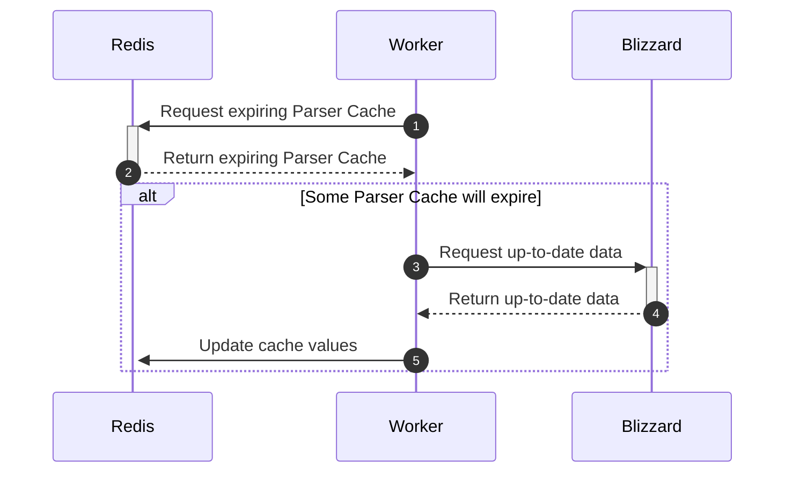

# ⚡ OverFast API

[](https://github.com/TeKrop/overfast-api/actions/workflows/build.yml)
[](https://sonarcloud.io/summary/new_code?id=TeKrop_overfast-api)

[](https://github.com/TeKrop/overfast-api/issues)
[](https://overfast-api.tekrop.fr)
[](https://github.com/TeKrop/overfast-api/blob/master/LICENSE)


> OverFast API provides comprehensive data on Overwatch 2 heroes, game modes, maps, and player statistics by scraping Blizzard pages. Developed with the efficiency of **FastAPI** and **Beautiful Soup**, it leverages **nginx** as a reverse proxy and **Redis** for caching. Its tailored caching mechanism significantly reduces calls to Blizzard pages, ensuring swift and precise data delivery to users.

## Table of contents
* [✨ Live instance](#-live-instance)
* [🐋 Run for production](#-run-for-production)
* [💽 Run as developer](#-run-as-developer)
* [👨‍💻 Technical details](#-technical-details)
* [🐍 Architecture](#-architecture)
* [🤝 Contributing](#-contributing)
* [🚀 Community projects](#-community-projects)
* [🙏 Credits](#-credits)
* [📝 License](#-license)


## ✨ [Live instance](https://overfast-api.tekrop.fr)
The live instance is restricted to **30 req/s** per IP (a shared limit across all endpoints). If you require more, consider hosting your own instance on a server 👍

- Live instance (Redoc documentation) : https://overfast-api.tekrop.fr/
- Swagger UI : https://overfast-api.tekrop.fr/docs
- Status page : https://stats.uptimerobot.com/E0k0yU1pJQ

## 🐋 Run for production
Running the project is straightforward. Ensure you have `docker` and `docker compose` installed. Next, generate a `.env` file using the provided `.env.dist` template. Finally, execute the following command:

```shell
make up
```

## 💽 Run as developer
Same as earlier, ensure you have `docker` and `docker compose` installed, and generate a `.env` file using the provided `.env.dist` template. You can customize the `.env` file according to your requirements to configure the volumes used by the OverFast API.

Then, execute the following commands to launch the dev server :

```shell
make build     # Build the images, needed for all further commands
make start     # Launch OverFast API (dev mode)
```
The dev server will be running on the port `8000`. You can use the `make down` command to stop and remove the containers. Feel free to type `make` or `make help` to access a comprehensive list of all available commands for your reference.

### Generic settings
Should you wish to customize according to your specific requirements, here is a detailed list of available settings:

- `APP_VOLUME_PATH`: Folder for shared app data like logs, Redis save file and dotenv file (app settings)
- `APP_PORT`: Port for the app container (default is `80`).
- `APP_BASE_URL` : Base URL for exposed links in endpoints like player search and maps listing.

You likely won't need to modify other generic settings, but if you're curious about their functionality, consult the docstrings within the `app/config.py` file for further details.

### Code Quality
The code quality is checked using `ruff`. I'm also using `ruff format` for imports ordering and code formatting, enforcing PEP-8 convention on my code. To check the quality of the code, you just have to run the following command :

```shell
make lint      # Run ruff linter
make format    # Run ruff formatter
```

### Testing
The code has been tested using unit testing, except some rare parts which are not relevant to test. There are tests on the parsers classes, the common classes, but also on the commands (run in CLI) and the API views (using FastAPI TestClient class).

Running tests with coverage (default)
```shell
make test
```

Running tests with given args
```shell
make test PYTEST_ARGS="tests/common"
```

### Pre-commit
The project is using [pre-commit](https://pre-commit.com/) framework to ensure code quality before making any commit on the repository. After installing the project dependencies, you can install the pre-commit by using the `pre-commit install` command.

The configuration can be found in the `.pre-commit-config.yaml` file. It consists in launching 2 processes on modified files before making any commit :
- `ruff` for linting and code formatting (with `ruff format`)
- `sourcery` for more code quality checks and a lot of simplifications

## 👨‍💻 Technical details

### Computed statistics values

In player career statistics, various conversions are applied for ease of use:
- **Duration values** are converted to **seconds** (integer)
- **Percent values** are represented as **integers**, omitting the percent symbol
- Integer and float string representations are converted to their respective types

### API Cache and Parser Cache

OverFast API integrates a **Redis**-based cache system, divided into two main components:
- **API Cache**: This high-level cache associates URIs (cache keys) with raw JSON data. Upon the initial request, if a cache entry exists, the **nginx** server returns the JSON data directly. Cached values are stored with varying TTL (Time-To-Live) parameters depending on the requested route.
- **Parser Cache**: Specifically designed for the API's parsing system, this cache stores parsing results (JSON objects) from HTML Blizzard pages. Its purpose is to minimize calls to Blizzard servers when requests involve filters. The cached values are refreshed in the background prior to expiration.

Here is the list of all TTL values configured for API Cache :
* Heroes list : 1 day
* Hero specific data : 1 day
* Roles list : 1 day
* Gamemodes list : 1 day
* Maps list : 1 day
* Players career : 1 hour
* Players search : 1 hour

### Refresh-Ahead cache system



To minimize requests to Blizzard servers, a Refresh-Ahead cache system has been deployed.

Upon the initial request for a player's career page, there may be a slight delay (approximately 2-3 seconds) as data is fetched from Blizzard. Following this, the computed data is cached in the Parser Cache, which is subsequently refreshed in the background by a dedicated worker, before expiration. Additionally, the final data is stored in the API Cache, which is generated only upon user requests.

This approach ensures that subsequent requests for the same career page are exceptionally swift, significantly enhancing user experience.


## 🐍 Architecture


Utilizing `docker compose`, this architecture provides response cache saving into Redis. Subsequent requests are then directly served by nginx without involving the Python server at all. This approach strikes the optimal performance balance, leveraging nginx's efficiency in serving static content. Depending on the configured Blizzard pages, a single request may trigger multiple Parser Cache requests.

## 🤝 Contributing

Contributions, issues and feature requests are welcome ! Do you want to update the heroes data (health, armor, shields, etc.) or the maps list ? Don't hesitate to consult the dedicated [CONTRIBUTING file](https://github.com/TeKrop/overfast-api/blob/main/CONTRIBUTING.md).


## 🚀 Community projects
Projects using OverFast API as a data source are listed below. Using it in your project? Reach out via email with your project link, and I'll add it!

- Datastrike, analysis and results tracking tool (https://datastrike.cloud)
- Discord Bot OW2 for stats (https://github.com/polsojac/ow2discordbot)
- OverBot, the best Overwatch bot for Discord (https://github.com/davidetacchini/overbot)
- Overfast API client (https://github.com/Sipixer/overfast-api-client)
- Overwatch Career Profile (https://github.com/EliaRenov/ow-career-profile)
- OverwatchPy, a Python wrapper for the API (https://github.com/alexraskin/overwatchpy)
- Watch Over, mobile app by @Backxtar (https://play.google.com/store/apps/details?id=de.backxtar.watchoveroverwatch)

## 🙏 Credits

All maps screenshots hosted by the API are owned by Blizzard. Sources :
- Blizzard Press Center (https://blizzard.gamespress.com)
- Overwatch Wiki (https://overwatch.fandom.com/wiki/)


## 📝 License

Copyright © 2021-2024 [Valentin PORCHET](https://github.com/TeKrop).

This project is [MIT](https://github.com/TeKrop/overfast-api/blob/master/LICENSE) licensed.
